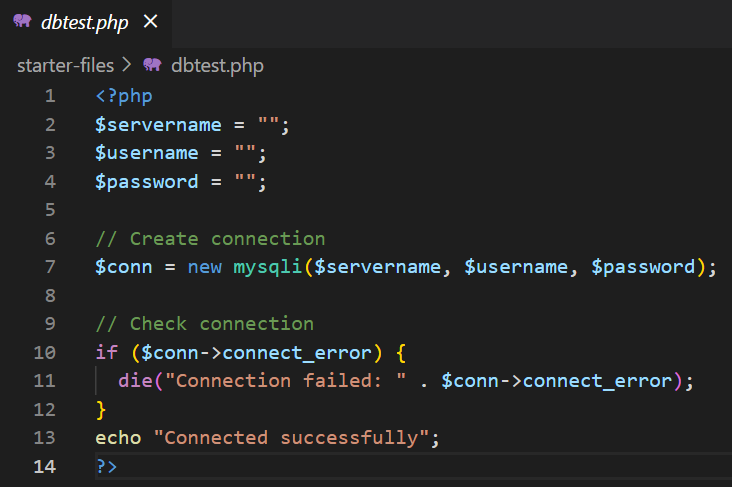

# The webserver and MySQL server are both served on Docker

# This is a website in PHP that will allow for the viewing, searching, inserting, updating and deleting of contacts from a MySQL database. SQL statements are injection proof through the use of PDO prepared statements. Forms to allow for insertion and update will have client-side validation of valid input through the use of JavaScript. Only authenticated users will be able to access the system.

# New users can be created on the the registration page. No two users can share the same name. Regex is used to validate password strength. The bcrypt password_hash function is used to ensure that your passwords are hashed before saving to the users database table.

# Only authenticated users will be able access the site’s pages and view/modify the data. A login screen that prompts for the username and password will be presented when a user tries to access any page of the website. The password field will be masked with asterisks when the user types. The login information will match against data stored in the WebUsers table that was added to the contacts database. If the credentials match, they will be redirected to the site; otherwise they will stay on the login screen and get an appropriate message. Each page will have a Logout button, which will redirect to the login page and clear current logged in credentials when clicked.

# contacts records will be displayed in an HTML table with borders and gridlines. Only a maximum of 25 rows from the contacts table will displayed on the page at any one time. The ability to page through the entire record set will be implemented with previous and next buttons/links. This paging feature must not break if users click on the previous link on the first page.

# The user will type a search string in a textbox and only matching results will display. The search string will be preserved in the textbox upon page refresh. The search string will be matched against both the contacts’s first and last name.

# New contacts records will be inserted. An HTML Form will allow the user to fill out all fields corresponding to contacts table. The HTML Form will be subjected to proper client-side validation prior to database insertion. A new contact ID will be generated for the new record. The number of affected rows will be reported.

# A specified record will be selectable for update. This will be done with the Edit button in the records table. An HTML Form will display, which will allow the user to modify fields that will be prepopulated to contain existing data corresponding to all fields in the contacts table. The HTML Form will be subjected to proper client-side regex validation prior to database update. The number of affected rows will be reported.

# A specified record will be selectable for deletion. This will be done with the Delete button in the records table. The deletion will be confirmed before executing.

# The number of affected rows will be reported.

# All deleted contacts records will be documented in the Former Contacts table.
